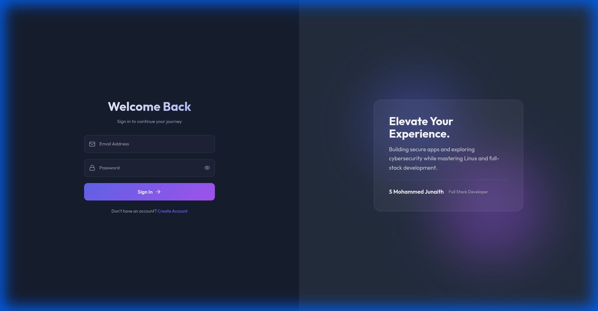
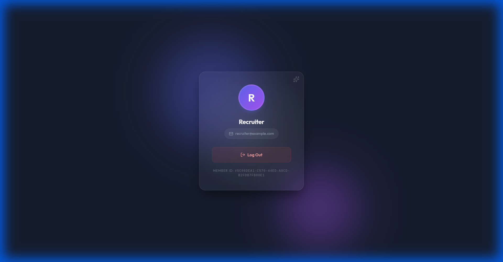

<div align="center">

# 🔮 Nexus Gate
### Secure Auth & Interactive Dashboard

<p align="center">
  
  
  
  
  
  
</p>

<p align="center">
  A production-ready authentication system with <b>secure JWT token handling</b> for cross-domain deployment.<br/>
  Featuring a glassmorphism UI and 3D interactive elements.
</p>

</div>

<br />

## 🔐 Security Architecture

<div align="center">

| Token | Storage | Transport | Expiry |
|:-----:|:-------:|:---------:|:------:|
| **Access Token** | React memory (RAM) | `Authorization: Bearer` | 15 mins |
| **Refresh Token** | HttpOnly cookie | Auto-sent by browser | 7 days |

</div>

### Key Security Features
- ✅ **Rotation Flow**: Refresh request -> Server validates -> Issues new token -> Invalidates old one.
- ✅ **Secure Cookies**: HttpOnly, Secure, SameSite=None configuration.
- ✅ **Token Hashing**: Refresh tokens are stored as hashes in the DB (bcrypt) for maximum security.
- ✅ **No LocalStorage**: Access tokens are kept in memory to prevent XSS attacks.
- ✅ **Database Backed**: Sessions stored in PostgreSQL for revocation support.
- ✅ **Redis Caching**: High-performance session validation.

---

### Cookie Configuration
```javascript
res.cookie("refreshToken", token, {
  httpOnly: true,
  secure: true,
  sameSite: "none",
  path: "/auth/refresh",
});
```

[Click here to view demo](https://loginsystem-mu.vercel.app/)

## 🚀 Features

<table>
  <tr>
    <td width="50%">
      <h3>🔐 Authentication</h3>
      
      <ul>
        <li>JWT access + refresh token flow</li>
        <li>Silent token refresh with Axios interceptors</li>
        <li>Secure logout (clears DB + Redis + cookie)</li>
        <li>Role-based access control (RBAC)</li>
      </ul>
    </td>
    <td width="50%">
      <h3>✨ User Experience</h3>
      
      <ul>
        <li>Glassmorphism UI design</li>
        <li>Interactive 3D dashboard card (mouse + gyroscope)</li>
        <li>Dynamic lighting effects</li>
        <li><b>Creative Loading Screen</b> with cybernetic core animation</li>
        <li>Enhanced Admin UI with shield indicators</li>
        <li>Mobile responsive layout</li>
      </ul>
    </td>
  </tr>
</table>

---

## 🛠️ Tech Stack

<div align="center">

| Layer | Technologies |
|:-----:|:------------|
| **Frontend** | React, Framer Motion, Axios, Lucide React |
| **Backend** | Node.js, Express, ioredis, pg (PostgreSQL) |
| **Database** | PostgreSQL 14+ |
| **Cache** | Redis |
| **Security** | bcrypt, jsonwebtoken, helmet, cors |

</div>

---

## ⚙️ Installation

### Prerequisites
- Node.js 18+
- PostgreSQL 14+
- Redis (optional, graceful fallback)

### 1. Clone & Install

```bash
git clone https://github.com/JunaithSM/Nexus-Gate---Secure-Auth-Interactive-Dashboard.git nexus-gate-auth-dashboard
cd nexus-gate-auth-dashboard

# Install backend dependencies
cd backend && npm install

# Install frontend dependencies
cd ../frontend && npm install
```

### 2. Database Setup

```bash
# Initialize database schema
# (Make sure you have created the 'auth_db' database first)
cd backend && npm run migrate
```

### 3. Environment Setup

**Backend** - Copy `backend/.env.example` to `backend/.env`:
```env
NODE_ENV=development
PORT=5000
FRONTEND_URL=http://localhost:3000

DB_HOST=localhost
DB_PORT=5432
DB_USER=your_user
DB_PASSWORD=your_password
DB_NAME=auth_db
DB_SSL=false

JWT_SECRET=generate-with-crypto-64-bytes
REFRESH_TOKEN_SECRET=different-secret-64-bytes

REDIS_URL=redis://localhost:6379
```

**Frontend** - Copy `frontend/.env.example` to `frontend/.env`:
```env
REACT_APP_API_URL=http://localhost:5000
```

### 4. Generate Secrets

```bash
node -e "console.log(require('crypto').randomBytes(64).toString('hex'))"
```

### 5. Run Development

```bash
# Terminal 1 - Backend
cd backend && npm run dev

# Terminal 2 - Frontend
cd frontend && npm start
```

---

## 🌐 Production Deployment

### Render (Backend)
1. Create Web Service from repo `/backend`.
2. Add PostgreSQL database.
3. Add Redis instance.
4. Set environment variables from `.env.example`.

### Vercel (Frontend)
1. Import repo, set root to `/frontend`.
2. Add environment variable:
   ```env
   REACT_APP_API_URL=https://your-api.onrender.com
   ```

---

## 📡 API Endpoints

| Method | Endpoint | Auth | Description |
|:------:|:---------|:----:|:------------|
| `POST` | `/auth/signup` | - | Register new user |
| `POST` | `/auth/signin` | - | Login, returns accessToken |
| `POST` | `/auth/refresh` | Cookie | Get new accessToken |
| `POST` | `/auth/logout` | Bearer | Clear session |
| `GET` | `/api/user` | Bearer | Get current user |
| `GET` | `/api/admin/users` | Bearer + Admin | List all users |

## 🛡️ Admin Access

To make a user an admin, run this SQL query:
```sql
UPDATE users SET role = 'admin' WHERE email = 'your@email.com';
```

---

## � Future Improvements

- [ ] **RBAC Granularity**: Move from simple roles to permission-based access (e.g., `user:read`, `user:ban`).
- [ ] **Audit Logs**: Track administrator actions for security compliance.
- [ ] **2FA**: Implement Two-Factor Authentication using TOTP.

---

## �📁 Project Structure

```
Login System/
├── backend/
│   ├── main.js
│   ├── migrations/      # SQL migration files
│   ├── scripts/         # Auto-migration script
│   └── src/
│       ├── config/      # env, db, redis, token, hash
│       ├── controllers/ # authController, userController
│       ├── middleware/  # authMiddleware, adminMiddleware
│       ├── repository/  # user.repo, refresh_session.repo
│       ├── routes/      # authRoutes.js, apiRoutes.js
│       └── services/    # sessionCache.js
│
└── frontend/
    └── src/
        ├── config.js    # Axios with interceptors
        ├── context/     # AuthContext (Global State)
        ├── components/  # RouteGuards, AuthLayout, StatusToast
        └── pages/       # SignIn, SignUp, Dashboard, Admin
```

---

## 📄 License

MIT License - See [LICENSE](LICENSE)
